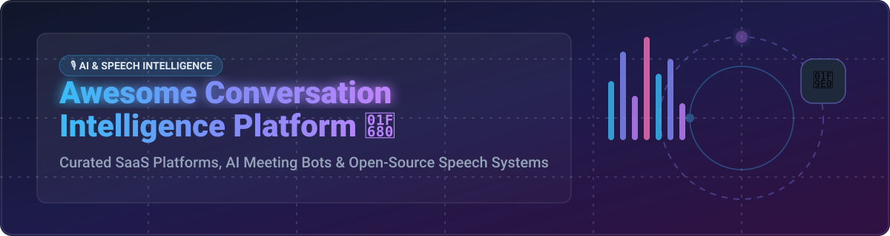

# 🎙️ Awesome Conversation Intelligence Platform 🚀

  
  
  
  
  

# 顶级会话智能平台生态系统 🌟

**精选 SaaS 产品与开源 GitHub 项目列表** 💡  
*聚焦会议录制、语音转写、AI 销售洞察与自动化摘要*

**最后更新：2026 年 9 月** 📅

---

本仓库追踪 **会话智能 (Conversation Intelligence)** 领域的知名 **SaaS 平台** 与 **开源项目**。这些工具帮助销售、客服和产品团队自动录制会议、转写对话、提取行动项、分析情绪与竞争情报，并将通话数据转化为可操作的收入洞察。

---

## 📊 行业市场规模与竞争格局 (Market Size & Industry Insights)

> 💡 **市场规模 estimated Market Size**: 全球会话智能与 AI 会议助手市场规模预计在 2026 年达到 **$35B+ USD**（复合年增长率 CAGR > 22%）。  
> ⚖️ **市场集中度 Concentration Level**: 本行业呈现 **高度割裂 (Highly Fragmented)** 状态。虽然头部 Enterprise 领域有 Gong、ZoomInfo Chorus 等领头羊，但在 SMB/PLG (Fireflies, tl;dv, Fathom) 以及自托管/本地优先开源生态 (Meetily, Vexa) 中涌现出大量创新产品，尚未形成“胜者通吃”的独占格局。

---

## 目录 📚

- [🌐 SaaS / 托管平台](#-saas--托管平台)
- [🔓 开源 GitHub 项目](#-开源-github-项目)
- [🤝 如何贡献](#-如何贡献)
- [💖 支持与赞助](#-支持与赞助)
- [📈 Star History](#-star-history)
- [⚠️ 免责声明](#-免责声明)

---

## 🌐 SaaS / 托管平台

以下为主流商业会话智能与 AI 会议助手 SaaS 平台，按 **公司规模/估值/年收入 (Market Size / Valuation / ARR)** 降序排列：

| 平台名称 | 估值 / 收入规模 💰 | 起步价格 🏷️ | 免费层 / 免费试用限制 🎁 | 核心功能与亮点 ⚡ |
| :--- | :--- | :--- | :--- | :--- |
| **[Gong](https://www.gong.io/)** 🏆 | **$7.2B 估值** ($200M+ ARR) | $1,200 / 用户 / 年 | 提供 14 天企业免费试用（受限录制与分析功能） | 市场领导者。自动录制和转写销售通话，分析客户情绪、竞争提及和交易风险，提供收入情报和预测。 |
| **[Chorus (ZoomInfo)](https://www.zoominfo.com/)** 🏢 | **$575M 收购价** (母公司 ZoomInfo $10B+ 市值) | $1,400 / 用户 / 年 | 仅提供定制化 Demo（需联系销售，无公开免费版） | ZoomInfo 旗下的会话智能平台。提供通话录制、转写、销售辅导和交易洞察，与 ZoomInfo 数据平台深度集成。 |
| **[Observe.AI](https://www.observe.ai/)** 📞 | **$500M+ 估值** ($50M+ ARR) | $1,200 / 席位 / 年 | 仅提供 14 天受限 Demo 试用 | 联系中心会话智能平台。分析客服通话，提供质量保证、合规监控和代理辅导。 |
| **[Salesloft Conversations](https://salesloft.com/)** 🚀 | **$2.3B 估值** (Salesloft 平台整合) | $75 / 用户 / 月 (包含在 Essentials 方案) | 仅提供定制团队 Demo 体验 | Salesloft 平台内的会话智能模块。提供通话录制、转写和销售洞察。 |
| **[Otter.ai](https://otter.ai/)** 🦦 | **$100M+ 估值** ($40M+ ARR) | $16.99 / 用户 / 月 (Pro 方案) | **永久免费**：每月 300 分钟转写，单次会议上限 30 分钟 | AI 会议转写和笔记平台。实时转写、自动摘要、行动项提取，广泛用于会议和采访。 |
| **[Fireflies.ai](https://fireflies.ai/)** 🐝 | **$50M+ 估值** ($15M+ ARR) | $18 / 用户 / 月 (Pro 方案) | **永久免费**：800 分钟存储空间，受限 AI 摘要与转写 | AI 会议助手。自动加入会议、录制、转写和生成摘要，支持搜索和协作。 |
| **[tl;dv](https://tldv.io/)** ⏱️ | **$25M+ 估值** | $25 / 用户 / 月 (Pro 方案) | **永久免费**：无限录制与转播，受限 AI 智能问答 | 会议录制和 AI 摘要工具。提供 Zoom、Google Meet、Teams 录制，时间戳标注和 AI 洞察。 |
| **[Grain](https://grain.com/)** 🌾 | **$20M+ 估值** | $19 / 用户 / 月 (Starter 方案) | **永久免费**：每月 20 次会议录制，单次限 60 分钟 | 会议录制和洞察平台。提供 AI 摘要、关键时刻剪辑和销售情报。 |
| **[Avoma](https://www.avoma.com/)** 🤖 | **$15M+ 估值** | $24 / 用户 / 月 (Starter 方案) | 14 天全功能免费试用 (无需信用卡) | 一体化会议助手和会话智能平台。提供会议录制、转写、摘要、行动项提取和收入情报。 |
| **[Fathom](https://fathom.video/)** ⚡ | **$10M+ 估值** | $32 / 用户 / 月 (Premium 方案) | **永久免费**：个人用户无限录制、转写和摘要 | 免费 AI 会议助手。自动录制、转写和摘要 Zoom、Meet、Teams 通话，提供即时回顾和行动项。 |

---

## 🔓 开源 GitHub 项目

会话智能的开源生态在 **本地优先转录、AI 会议机器人与对话分析** 层面快速成熟。以下项目按 **GitHub Star 数量** 降序排列：

| 项目名称 | GitHub Stars 🌟 | 许可证 📜 | 类别 / 架构 🏗️ | 项目描述与关键特性 🔍 |
| :--- | :--- | :--- | :--- | :--- |
| **[Meetily](https://github.com/Zackriya-Solutions/meeting-minutes)** 🏆 |  | MIT | 本地优先会议助手 | **最受关注的开源会议笔记工具**。完全本地运行：使用 Whisper 和 Parakeet 模型进行 4 倍速实时转写，Ollama 在设备上生成摘要。捕获麦克风和系统音频，GPU 加速自动配置，支持 macOS 和 Windows。 |
| **[WhisperX](https://github.com/m-bain/whisperX)** ⚡ |  | BSD-2-Clause | 语音转写 & 说话人分离 | 具备精确词级时间戳和 VAD 说话人分离 (Diarization) 的超快速 Whisper 语音识别管道，是构建会话智能的核心底层库。 |
| **[PyAnnote-Audio](https://github.com/pyannote/pyannote-audio)** 🎙️ |  | MIT | 说话人分离 Toolkit | 基于 PyTorch 的先进开源说话人分离与语音识别框架，广泛应用于区分会议中不同说话人的声音。 |
| **[Vexa](https://github.com/Vexa-ai/vexa)** 🤖 |  | Apache-2.0 | 自托管会议机器人 | 支持自动加入 Google Meet、Zoom、Teams 的自托管会议机器人平台。实时 WebSocket 转播，支持 100 种语言及 MCP 17 工具接口。 |
| **[InsightAudio](https://github.com/ggauravky/InsightAudio)** 🧠 |  | MIT | 本地会议 RAG | 自托管的 AI 会议助手。使用 Whisper 本地转写，Mistral 生成摘要，配合 ChromaDB 实现会议记录 RAG 问答与 Streamlit 界面。 |
| **[Quill](https://github.com/humanitas-labs/quill)** 🪶 |  | MIT | macOS 原生录音 | 极简 macOS 本地录制和转写工具。独立捕获双向音频轨道，设备端实时转写，离线数据保护。 |
| **[Nora](https://github.com/sf0rzin/nora)** 🛡️ |  | AGPL-3.0 | 企业级会话智能 | 面向企业级的多租户会话智能平台。Spring Boot + Next.js + Tauri 客户端，内置 PostgreSQL 行级安全 (RLS) 与 PII 数据脱敏。 |
| **[CEREBRO (MindShift)](https://github.com/officialarghya29/MindShift)** 📈 |  | MIT | 对话情感分析引擎 | 上下文感知的时间序列对话智能引擎。支持情感/情绪/语调三维分析、讽刺检测及对话升级轨迹预测。 |
| **[SideQuest](https://github.com/aechemm/sidequest)** 🕸️ |  | MIT | 关系图谱构建 | 跨对话关系图谱和介绍推荐系统。基于 Plaud 录音或文本转录，通过 Neo4j 构建对话实体关系链。 |

---

## 🛠️ 最佳开源构建组合 (Architectural Blueprints)

对于想要构建自定义、隐私优先或自托管会话智能系统的团队，推荐组合：
- **音频采集 & 转写**：[Meetily](https://github.com/Zackriya-Solutions/meeting-minutes) 或 [WhisperX](https://github.com/m-bain/whisperX)
- **多平台会议 Bot 接入**：[Vexa](https://github.com/Vexa-ai/vexa)
- **企业多租户架构与安全**：[Nora](https://github.com/sf0rzin/nora)
- **高级对话分析与图谱**：[CEREBRO](https://github.com/officialarghya29/MindShift) + [SideQuest](https://github.com/aechemm/sidequest)

---

## 🤝 如何贡献 (Contributing)

1. Fork 仓库 🍴
2. 在 `README.md` 中添加/编辑条目（遵循现有表格格式）
3. 包含：名称、官方链接、价格/Star数、简短事实性描述
4. 提交 Pull Request 并附简短说明 🚀

---

## 💖 支持与赞助 (Support & Sponsor)

如果您觉得这个项目有帮助，欢迎予以支持！您的支持是维持此开源列表更新的最大动力。

- ⭐️ **Star** 本仓库以获得更新通知！
- 🔀 **Fork** 本项目并提交改进！
- 📢 **分享** 给您的同事与开发者朋友！
- ☕ **请作者喝杯咖啡 (Sponsor)**: 欢迎访问我的 [GitHub Sponsor Dashboard](https://github.com/sponsors/ishandutta2007) 进行赞助。

---

## 📈 Star History

---

## ⚠️ 免责声明 (Disclaimer)

- 这是一个**社区精选**列表——并非详尽无遗，也不构成任何商业背书。
- 会话智能平台处理敏感的销售通话和客户对话数据；使用时请确保遵守 GDPR、CCPA 和适用的合规法规。
- 如果您在列表中发现任何链接、价格或数据不准确，请提交 PR 予以修正！
